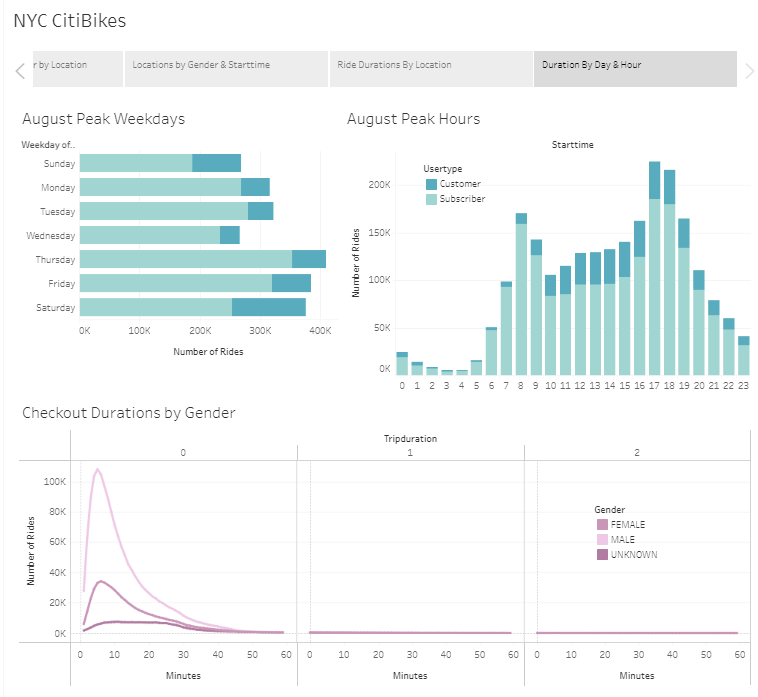

#  NYC CitiBike Analysis

## Overview 

The purpose of this analysis was to explore user data for NYC CitiBikes through visualizations to identify trends and make observations that could be useful when exanding the bike rental service to other cities.

## Results

The Tableau story containing the visualizations in the analysis can be found here: [NYC CitiBikes Story](https://public.tableau.com/profile/lindsay.macdonald#!/vizhome/NYCCitiBikeDashboard_16195910975670/NYCCitiBikes)

1. The first visualization explores the relationship between usertype and age/gender demographics. While the age distribution is similar between the genders, a distinct shift in the age distribution can be observed when comparing subscribers and non-subscribing customers. The subscribers tend to be older than non-subscribers, this makes sense because if a new user finds themselves using the service regularly, in time it is likely they will in time seek out a subscription.

2. The second visualization shows the different starting and ending locations filtered by gender, weekday, and usertype. We can clearly see that the greatest number of rides are taken by male subscribers, this is consisten across the days of the week. We can also see that non-subscribing customers have a tendency to pick up and drop off their bikes at locations around Central Park, the Hudson River, and Brooklyn Bridge, suggesting these users are tourists. We can also see that subscribers during the workweek tend to pick up and drop off their bikes at locations in central Manhattan suggesting that they use the service for their daily commute to and from work.

3. The third visualization explores the relationship between start time and both usertype and gender. The most important insight we can gleen from these charts is that subscribers tend to use the service more during the weekday commute hours, while non-subscribing customers' peak usage is spread throughout the day on weekends. This supports our observations from the previous visualization about subscribers being locals commuting to and from work and non-subscribers being tourists. 

4. The fourth vizualization shows the weekly usage by men and women users for a side-by-side comparison, and shows us where these users started and ended their trips. Again, we see the peaks during commute hours during the workweek and consistent use throughout the day on weekends. 

5. The fifth visualization shows the relationship between trip duration and both weekday and start time. The different distribution of start times on weekdays vs. weekends is highlighted again. We can also see that while subscribers tend to use the service for shorter durations, the majority of users are non-subscribers when looking at trips with durations longer than 1 hour .     

6. The sixth visualization shows the different start and stop locations filtered by trip duration. When looking at trips with duration longer than 1 hour we can see that the starting and stopping locations are in tourist areas, including Central Park, the Hudson River, and the Brooklyn Bridge. 

## Summary

There two distinct categories of users that comprise the majority of CitiBike's customers that should be considered when looking into expanding service to other cities:
- subscribers who use the service for their relatively short daily commutes to and from work on weekdays
- non-subscribers who use the service for longer-duration, midday trips likely for tourism 

There are additional factors that will affect service usage that should be considered when choosing potential expansion cities that could be explored through further inverstigation and would add to our visualizations: 
- weather/climate
- pre-existing public transport
 

